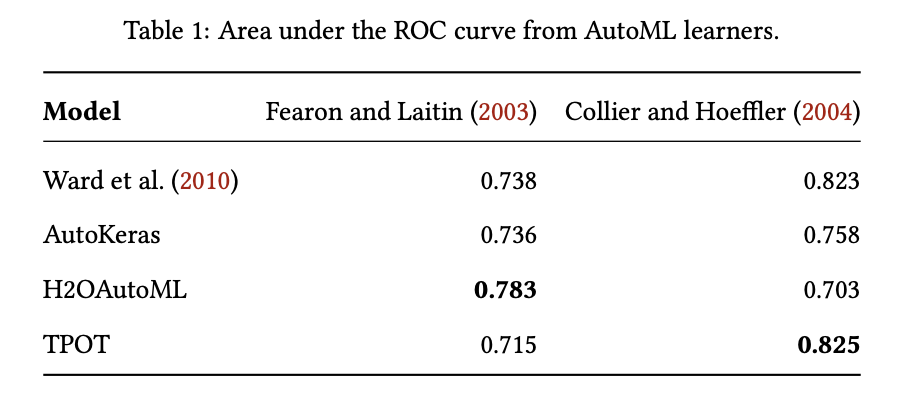
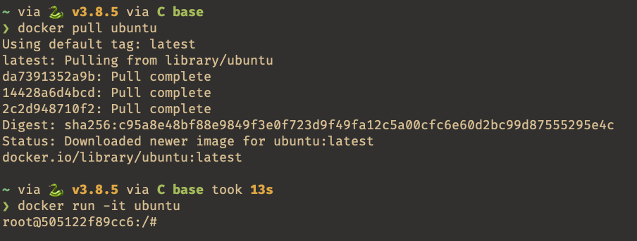
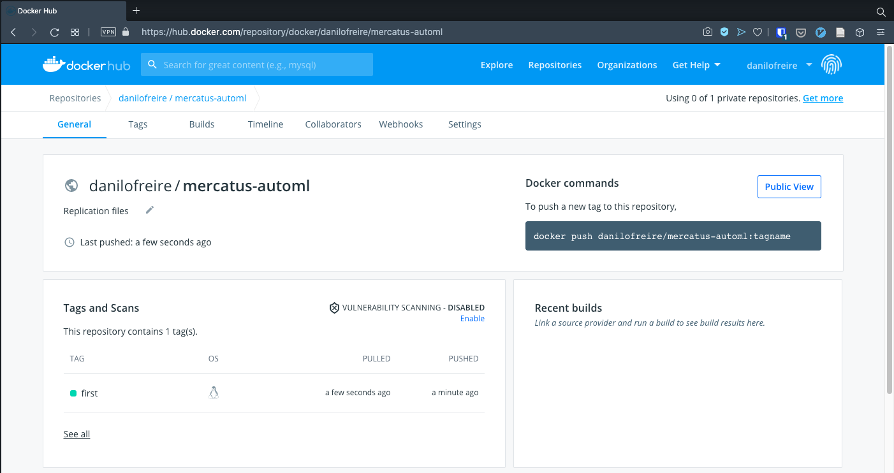

```{r xaringan-themer, include=FALSE, warning=FALSE}
options(htmltools.dir.version = FALSE)
list.of.packages <- c("xaringan", "xaringanthemer")
new.packages <- list.of.packages[!(list.of.packages %in% installed.packages()[,"Package"])]
if(length(new.packages)) install.packages(new.packages)
library(xaringanthemer)
style_mono_accent(
  base_color = "#1c5253",
  header_h1_font_size = "2.25rem",
  header_h2_font_size = "1.85rem",
  header_font_google  = google_font("Josefin Sans"),
  text_font_google    = google_font("Montserrat", "300", "300i"),
  text_font_size      = "1.45rem",
  code_font_google    = google_font("Fira Mono")
)
```

# Motivation

* Machine learning has been increasingly used to tackle social science problems

* "Prediction policy problems": forecasting accuracy is more important than
  unbiased coefficients

* Forecasting: civil conflicts, state repression, genocide

* Optimise resource allocation: fire inspection teams, patients

---

# Motivation

* However, machine learning methods remain difficult to use for most scholars

* Several steps: data pre-processing, algorithm selection, model optimisation

* Little technical advice; trial and error

* Many fields that could benefit from machine learning modelling can't use
  these models

* Simplifying machine learning pipeline may have a significant impact on academic
  research

--

* _How can scholars with little technical expertise apply machine learning in
  their work?_

---

# What I do

* Scholars _don't need_ to know much about algorithms to use them in their everyday
  tasks

* Automated machine learning (AutoML) is a new framework that automatically
  optimises algorithms

* Easy to install, quick to deploy, one needs just four lines of code to
  estimate thousands of models

* Widely used in computer science, little known in political science and
  economics

---

# What I do

* Brief overview of three AutoML algorithms for Python

* How to install and use AutoML with tabular data

* Replicate [Ward et al. (2011)](https://journals.sagepub.com/doi/10.1177/0022343309356491) and
  predict civil war onset using AutoML algorithms

* AutoML has great performance, even beating the benchmark in some
  specifications

* How to use [Docker](docker.com) to create a fully reproducible machine
  learning pipeline 

* Share and replicate models with containers

---

class: center, middle, inverse

# Overview of three AutoML algorithms

---

# Intuition

* AutoML algorithms try to find the model that best predicts the outcome in a
  given dataset using a pre-specified metric

--

* First step: split the data into training and test sets


--

* Second step: define a metric


--

* Third step: test many algorithms with standard configurations within the
  training data, select the one which gives the best results


--

* Fourth step: randomly change the model hyperparameters until they stop
  improving the score or the user decides to stop the AutoML algorithm

---

# Pros

* AutoML models mimic genetic selection: from a set of random features, select
  the ones which "survive" after each round. _It works_

* Consistently rank among the top 5% in [Kaggle competitions](https://ai.googleblog.com/2019/05/an-end-to-end-automl-solution-for.html)

* Free scholars from doing boring, labour-intensive tasks (tweaking model
  parameters)

* Allow new users to create good machine learning models with little code

* Most have techniques that help users to interpret their models (variable
  importance, partial dependency plots, shap values, etc)

---

# Cons

* Often take a while to run

* Computationally intensive for large datasets 

* Still do not outperform the best human-made models

* Black boxes

---

# AutoKeras

* Based on Google's popular [Tensorflow](tensorflow.org) algorithm for deep learning

* Automated version of the [Keras](keras.io) interface

* Uses neural networks to perform classification and regression tasks
  - Text
  - Tabular data
  - Images
  - Sound files

* Free and open source, available for [Python and R](autokeras.com)

---

# AutoKeras

* Large community of users

* Easy to use and get support

* Only four lines of code to run a classification task

```{python, eval=F}
import autokeras as ak                # load library

model = ak.StructuredDataClassifier() # build model for tabular data
model.fit(X_train, y_train)           # fit model with training data split
predictions = model.predict(X_test)   # predictions
```

---

# H2OAutoML

* Developed by [H2O.ai](H2O.ai)

* Commercial support

* Also free and open source

* Graphic user interface to help beginners

* Large collection of model explainability functions

---

# H2OAutoML

* Needs a bit more code than AutoKeras

```{python, eval=F}
import h2o                                       # load library
from h2o.automl import H2OAutoML                 # load AutoML functions
h2o.init()                                       # start the module

train = h2o.import_file("path/to/training_data") # load training data
test = h2o.import_file("path/to/test_data")      # load test data

x = train.columns                                # independent variables
y = "dependent_variable_name"                    # dependent variable
x.remove(y)                                      # remove dependent variable from matrix

model = H2OAutoML(max_models=30, seed=1234)      # run 30 machine learning models
model.train(x=x, y=y, training_frame=train)      # estimate model
predictions = model.predict(test)                # get predictions
```

---

# TPOT

* One of oldest AutoML solutions for Python

* Built on top of [scikit-learn](https://scikit-learn.org)

* Very robust algorithm

* Supports GPU acceleration 

* Fast estimation times

---

# TPOT

* Very easy to use

```{python, eval=F}
from tpot import TPOTClassifier    # load library

model = TPOTClassifier()           # build model
model.fit(X_train, y_train)        # fit model
print(model.score(X_test, y_test)) # print model evaluation
```

---

class: center, middle, inverse

# A Replication of Ward et al. (2011)

---

# Ward et al. (2011)

* How do AutoML models compare with expert-coded machine learning? 

* I replicate [Ward et al. (2011)](https://journals.sagepub.com/doi/10.1177/0022343309356491)

* Authors test out-of-sample predictive power of the two most widely-cited articles on
  civil war onset:
  - Fearon and Laitin's "[Ethnicity, Insurgency, and Civil Wars](https://www.jstor.org/stable/3118222)" (2003)
  - Collier and Hoeffler's "[Greed and Grievance in Civil Wars](https://academic.oup.com/oep/article-abstract/56/4/563/2361902)" (2004)

---

# Ward et al. (2011)

* Hard case for predictive algorithms:
  - Rare event (~ 1%)
  - Noisy data
  - Measurement error
  - Causal relationships not well defined

* Dependent variable: civil war onset in a given country-year

* Independent variables: controls included in both papers (political, economic,
  and ethnic factors)

---

# Replication

* Split the data into training and test set (75%/25%)

* Five cross-validation folds

* Each model could run for only 10 minutes

* Area under the ROC curve as the target metric

* Used the same random number from [random.org](http://random.org) (8305) 
 
---

# Replication



---

class: center, middle, inverse

# Sharing AutoML Models with Docker

---

# Docker 

* [Docker](docker.com) is a virtualisation platform 

* Users can build and deploy their software on top of a lightweight operating
  system, usually Linux

* Instead of sharing only data and code, Docker allows scholars to share their
  complete software environment in containers

* Users need only a few commands to create and share Docker images 

---

# Running Docker

* After installing Docker and creating an account, just download Ubuntu with

```{bash, eval=F}
docker pull ubuntu    # download image from DockerHub
docker run -it ubuntu # run image; -it to start the Docker container
```

* You will see a root session in your terminal



---

# Installing the AutoML algorithms

* Just install Python and the algorithms we want to use

* `pip3` install Python modules

```{bash, eval=F}
apt update -y                                      # update the system
apt install python3 python3-pip r-base default-jre # required files
pip3 install autokeras                             # AutoKeras
pip3 install h2o                                   # H2O AutoML
pip3 install tpot                                  # TPOT
exit                                               # stop
```
---

# DockerHub

* [DockerHub](hub.docker.com) hosts Docker images for free

* Works like [git](https://git-scm.com/) and [GitHub](http://github.com): add, commit, and push

* Add:
  
```{bash, eval=F, size="footnotesize", warning=F, error=F}
docker cp ~/path/to/file/automl.Rmd ID:/automl.Rmd   # copy script
docker cp ~/path/to/file/fl_data.csv ID:/fl_data.csv # copy data
```

* Commit:

```{bash, eval=F, size="footnotesize", warning=F, error=F}
docker commit ID mercatus-automl
```

* Push:

```{bash, eval=F, size="footnotesize", warning=F, error=F}
docker tag ID danilofreire/mercatus-automl:first # add tag
docker push danilofreire/mercatus-automl:first   # push image to DockerHub
```

---

# DockerHub

* The image is online and ready to be shared



* <https://hub.docker.com/repository/docker/danilofreire/mercatus-automl>

---

# Conclusion

* Social scientists have increasingly used machine learning to predict a myriad
  of outcomes

* AutoML facilitates machine learning tasks 

* Allows non-experts to use sophisticated computer estimations

* Provides good benchmarks for experienced users

* Easy to run and use

* Free and open source

---

# Conclusion

* AutoML's predictive accuracy can be as good as, or better than, expert-coded models

* Models can be easily shared and deployed with Docker containers

* Docker ensures that all analyses are fully reproducible

* One step further from our current reproducibility practices

* Users can host their entire machine learning pipelines on DockerHub

---

# Next steps

* Test how well automated machine learning works with textual data
  - Content classification, sentiment analysis, document translation

* Compare the performance of AutoML algorithms in other areas of interest to
  policy analysts
  - Electoral outcomes, economic forecasting

* Test whether AutoML can be useful to find heterogeneous treatment effects in
  experimental research

* Write an applied research paper replicating a number of studies that forecast
  civil conflicts

---

class: center, middle, inverse

# Thank you very much!

---

# Let's keep in touch!

<br><br><br>

* Danilo Freire:

  - [danilofreire@gmail.com](mailto:danilofreire@gmail.com)
  - <http://danilofreire.github.io>
  - <http://github.com/danilofreire/mercatus-analytics-papers>
